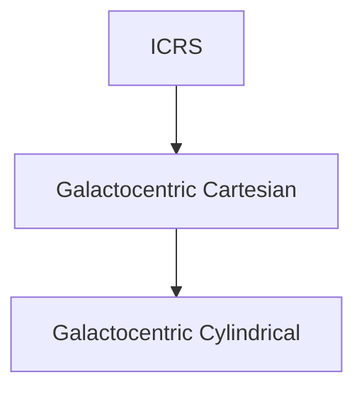

# Galactocentric transformation
These codes require six parameters from Gaia data: right ascension $\alpha$ [deg], declination $\delta$ [deg], parallax $\varpi$ [mas] and their velocities $\mu_\alpha$ [mas/year], $\mu_\delta$ [mas/year], $v_r$ [km/s]. 
We want to transform these coordinates to Galactrocentric Cartesian coordinates: x, y, z, $v_x$, $v_y$, $v_z$ and then to Galactocentric Cylindrical coordinates: r, $\varphi$, z, $v_r$, $v_\varphi$, $v_z$.

All Gaia parameters can be found [here.](https://gea.esac.esa.int/archive/documentation/GDR2/Gaia_archive/chap_datamodel/sec_dm_main_tables/ssec_dm_gaia_source.html) 
## Positional observables
Transforming ICRS coordinates to Galactocentric x,y,z.

Here's an example:

