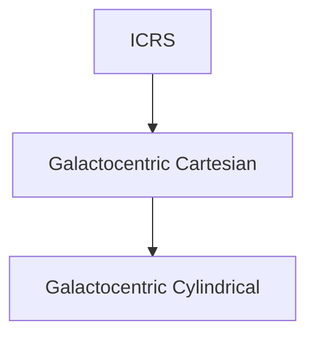
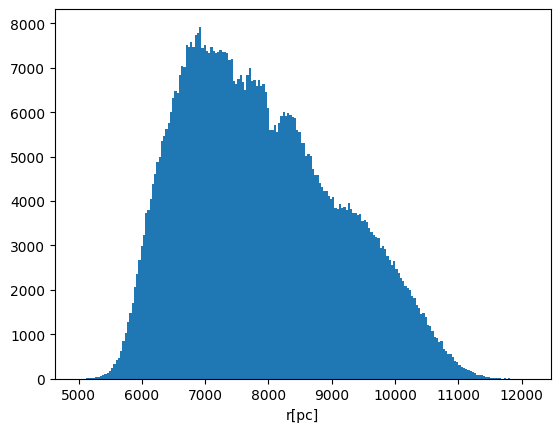
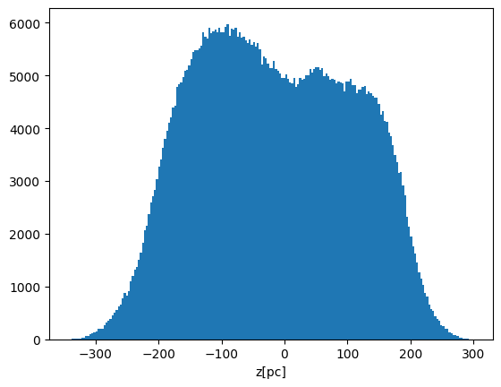
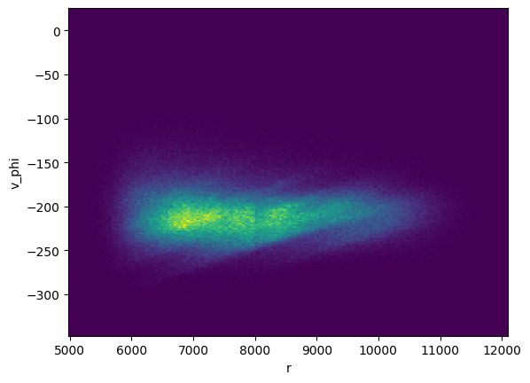

# Galactocentric transformation
These codes require six parameters from Gaia data: right ascension $\alpha$ [deg], declination $\delta$ [deg], parallax $\varpi$ [mas] and their velocities $\mu_\alpha$ [mas/year], $\mu_\delta$ [mas/year], $v_r$ [km/s]. 
We want to transform these coordinates to Galactrocentric Cartesian coordinates: x, y, z, $v_x$, $v_y$, $v_z$ and then to Galactocentric Cylindrical coordinates: r, $\varphi$, z, $v_r$, $v_\varphi$, $v_z$.



All Gaia parameters can be found [here.](https://gea.esac.esa.int/archive/documentation/GDR2/Gaia_archive/chap_datamodel/sec_dm_main_tables/ssec_dm_gaia_source.html) 

## Positional observables
Transforming ICRS coordinates $\alpha$, $\delta$, $\varpi$ to Galactocentric Cartesian coordinates x, y, z.

$\textbf{r}_{ICRS}=\begin{bmatrix} 
x_{ICRS}\\ 
y_{ICRS}\\ 
z_{ICRS}\\
\end{bmatrix}=\begin{bmatrix} \frac{k_1}{\varpi} cos(\alpha) cos(\delta)\\ 
\frac{k_1}{\varpi} sin(\alpha) cos(\delta)\\
\frac{k_1}{\varpi} sin(\delta) \end{bmatrix}$

where $k_1=10^3$ [pc] is a scaling factor and $\varpi$ [mas] is the measured annual parallax of the star.

$\begin{bmatrix} 
x\\ 
y\\ 
z\\
\end{bmatrix}=\textbf{H}\begin{pmatrix} \textbf{A}_G^T \begin{bmatrix} x_{ICRS}\\ 
y_{ICRS}\\ 
z_{ICRS}\\ 
\end{bmatrix} -R_0 \begin{bmatrix} 1\\ 0\\ 0\\ \end{bmatrix} \end{pmatrix}$

Matrix $\textbf{H}$ accounts for the Sun's height over the Galactic plane, defined as:

$\textbf{H}=\begin{bmatrix} cos(\theta) & 0 & sin(\theta)\\
0 & 1 & 0\\
-sin(\theta) & 0 & cos(\theta) \end{bmatrix}$

where $\theta$ is the angle between the position vector of the Sun and the Galactic plane $\theta=sin^{−1}
(\frac{z_0}{R_0})$.

Matrix $\textbf{A}_G^T$ is a 3x3 fixed orthogonal matrix, which is responsible for the rotation of the coordinate frame and is
defined as:

$\textbf{A}_G^T= \begin{bmatrix} −0.0548755604162154 & −0.8734370902348850 & −0.4838350155487132\\
0.4941094278755837 & −0.4448296299600112 & 0.7469822444972189\\
−0.8676661490190047 & −0.1980763734312015 & 0.4559837761750669 \end{bmatrix}$

Transforming the velocities to Galactocentric Cartesian, using  the right ascension and declination proper
motion components $\begin{pmatrix} \mu_\alpha , \mu_\delta \end{pmatrix}$ as well as the radial velocity $\begin{pmatrix} v_r \end{pmatrix}$:

$\begin{bmatrix} v_x\\ v_y\\ v_z \end{bmatrix}=\textbf{H}\textbf{A}_G^T\textbf{B} \begin{bmatrix} v_r\\ 
\frac{k_2}{\varpi}\mu_\alpha*\\ 
\frac{k_2}{\varpi}\mu_\delta \end{bmatrix} + \begin{bmatrix} U_\odot\\ V_{\odot,TOT}\\ W_\odot \end{bmatrix}$

where the scaling factor $k_2=4.74047$ [pc] and the $\textbf{B}$ matrix is a coordinate matrix dependent on the right ascension and
declination of the star, defined as:

$\textbf{B}=\begin{bmatrix} cos(\alpha) & -sin(\alpha) & 0\\
sin(\alpha) & cos(\alpha) & 0\\
0 & 0 & 1 \end{bmatrix}\begin{bmatrix} cos(\delta) & 0 & -sin(\delta)\\
0 & 1 & 0\\
sin(\delta) & 0 & cos(\delta) \end{bmatrix}$

Here's an example:
```py
from data_analysis import get_transformed_data
df=pd.read_csv(path)
df_new=get_transformed_data(df,
                        include_cylindrical = False,
                        z_0 = 17,
                        r_0 = 8178,
                        v_sun = ([[11.1], [232.24], [7.25]])
                        is_bayes = False,
                        is_output_frame = False,
                        is_source_included = False,
                        NUMPY_LIB = np,
                        dtype = np.float64)
```
ICRS:


<!----->

Galactocentric Cartesian:


Now we can transform the Galactocentric Cartesian coordinates x, y, z to Galactocentric Cylindrical coordinates r, $\varphi$, z.

Here's an example:
```py
from data_analysis import get_transformed_data
df=pd.read_csv(path)
df_new=get_transformed_data(df,
                        include_cylindrical = True,
                        z_0 = 17,
                        r_0 = 8178,
                        v_sun = ([[11.1], [232.24], [7.25]])
                        is_bayes = False,
                        is_output_frame = False,
                        is_source_included = False,
                        NUMPY_LIB = np,
                        dtype = np.float64)
```
Galactocentric Cylindrical:

(näitab tähtede kaugust Galaktika tsentrist)



(näitab tähtede paiknemist Galaktika diski suhtes)



## Velocities
We can also transform velocities the same way as coordinates, from one system to another.

Here's and example of how to transform ICRS velocities to Galactocentric Cartesian velocities:
```py
from data_analysis import get_transformed_data
df=pd.read_csv(path)
df_new=get_transformed_data(df,
                        include_cylindrical = False,
                        z_0 = 17,
                        r_0 = 8178,
                        v_sun = ([[11.1], [232.24], [7.25]])
                        is_bayes = False,
                        is_output_frame = False,
                        is_source_included = False,
                        NUMPY_LIB = np,
                        dtype = np.float64)
```
Galactocentric Cartesian:


Now we can transform the Galactocentric Cartesian velocities to Galactocentric Cylindrical velocities.

Here's an example:
```py
from data_analysis import get_transformed_data
df=pd.read_csv(path)
df_new=get_transformed_data(df,
                        include_cylindrical = True,
                        z_0 = 17,
                        r_0 = 8178,
                        v_sun = ([[11.1], [232.24], [7.25]])
                        is_bayes = False,
                        is_output_frame = False,
                        is_source_included = False,
                        NUMPY_LIB = np,
                        dtype = np.float64)
```
Galactocentric Cylindrical:

